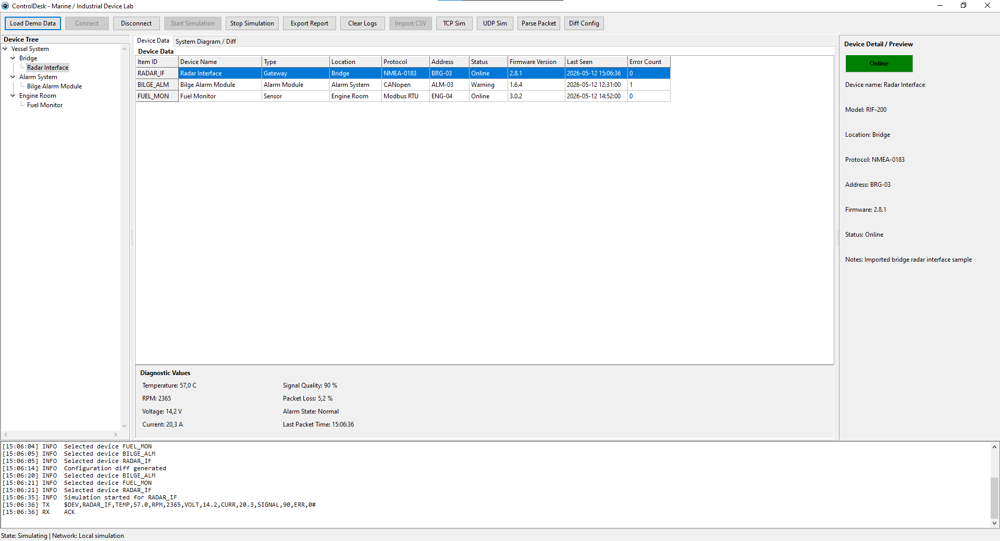
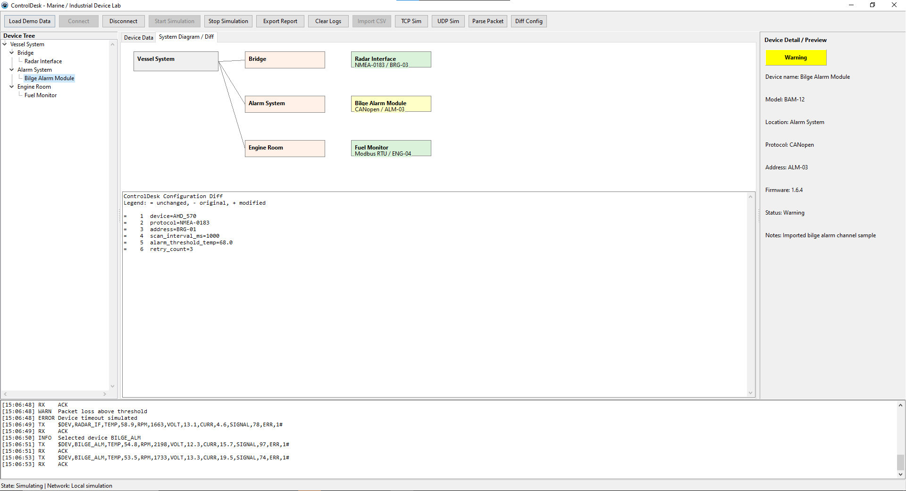

# ControlDesk

ControlDesk is a Lazarus/Object Pascal desktop portfolio project inspired by marine and industrial engineering tools.

It simulates a device configuration and diagnostics workstation with a vessel/device hierarchy, device grid, live diagnostics, protocol packet logs, CSV import, report export, configuration diffing, packet parsing, and a system diagram view.

## Features

- In-memory demo devices for bridge, alarm, and engine-room systems.
- Connection and simulation state management.
- Timer-based diagnostic values without blocking the UI.
- Protocol packet builder and parser for `$DEV,...#` messages.
- Safe TCP server and UDP broadcast simulation modes that only log traffic and do not open ports.
- CSV device import.
- Text report export through a save dialog.
- Configuration diff tool for two selected text files.
- System diagram tab drawn inside the Lazarus UI.

## Sample Files

- `sample_devices.csv` demonstrates the CSV import format.
- `sample_config_a.cfg` and `sample_config_b.cfg` can be used with **Diff Config**.

## Run

Open `project1.lpi` in Lazarus and choose **Run > Build** or **Run > Run**.

## Packet Test

Build and run `tests_packet_builder.lpr` with Free Pascal/Lazarus to validate packet creation and parsing.

## Screenshots

### Device Data and Live Diagnostics

### System Diagram and Configuration Diff

